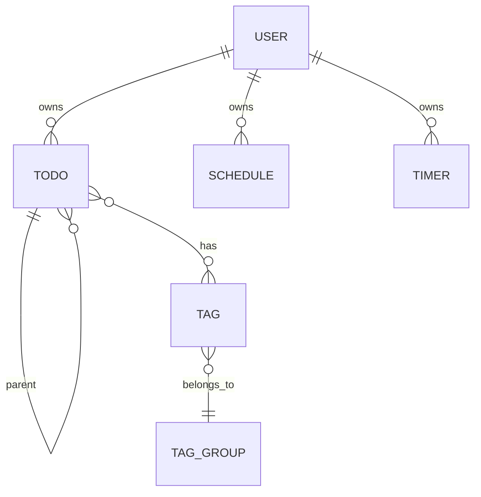

# StepIn Backend

취업 준비생을 위한 스마트 플랜 관리 서비스 - Backend API

## 📖 Overview

StepIn Backend는 취업 준비생들의 학습 계획 관리를 위한 RESTful API 서버입니다. FastAPI 기반으로 구축되었으며, Todo 관리, 프리셋 로드맵, 태그 시스템 등의 기능을 제공합니다.

## ✨ Features

### 📋 Todo System
- 계층적 투두 관리 (부모-자식 트리 구조)
- 상태 관리 (unscheduled, scheduled, done)
- 프리셋 기반 투두 일괄 생성

### 📦 Preset (Roadmap)
- 사전 정의된 학습 로드맵 제공
- 로드맵 복사 및 개인화
- 카테고리별 프리셋 탐색

### 🏷️ Tag System
- 태그 그룹 관리
- 커스텀 컬러 지원 (#RRGGBB)
- 태그 기반 투두 분류

### 👥 Social Features
- 친구 관계 관리
- 일정 조율 (Meeting)
- 가시성 설정

## 🚀 Quick Start

### Prerequisites
- Python 3.11+
- PostgreSQL

### Installation

```bash
# Clone repository
git clone https://github.com/GDGOC-ONE-WAVE-TEAM19/nana-BE.git
cd nana-BE

# Install dependencies
pip install -r requirements.txt

# Set up environment variables
cp .env.example .env

# Run migrations
alembic upgrade head

# Start server
uvicorn app.main:app --reload
```

## 📚 API Reference

### Base URL
```
/v1
```

### 주요 Endpoints

#### Todos API
| Method | Endpoint | Description |
|--------|----------|-------------|
| `GET` | `/v1/todos` | 투두 목록 조회 |
| `POST` | `/v1/todos` | 투두 생성 |
| `PATCH` | `/v1/todos/{todo_id}` | 투두 수정 |
| `DELETE` | `/v1/todos/{todo_id}` | 투두 삭제 |
| `GET` | `/v1/todos/presets` | 프리셋 목록 조회 |
| `GET` | `/v1/todos/presets/{preset_name}` | 프리셋 상세 조회 |
| `POST` | `/v1/todos/initialize/{preset_name}` | 프리셋으로 투두 초기화 |

#### Tags API
| Method | Endpoint | Description |
|--------|----------|-------------|
| `GET` | `/v1/tags` | 태그 목록 조회 |
| `POST` | `/v1/tags` | 태그 생성 |
| `DELETE` | `/v1/tags/{tag_id}` | 태그 삭제 |
| `GET` | `/v1/tags/groups` | 태그 그룹 목록 |

#### Schedules API
| Method | Endpoint | Description |
|--------|----------|-------------|
| `GET` | `/v1/schedules` | 일정 목록 조회 |
| `POST` | `/v1/schedules` | 일정 생성 |
| `DELETE` | `/v1/schedules/{schedule_id}` | 일정 삭제 |

#### Timers API
| Method | Endpoint | Description |
|--------|----------|-------------|
| `GET` | `/v1/timers` | 타이머 목록 조회 |
| `POST` | `/v1/timers` | 타이머 생성 |
| `POST` | `/v1/timers/{timer_id}/start` | 타이머 시작 |
| `POST` | `/v1/timers/{timer_id}/pause` | 타이머 일시정지 |

#### Meetings API
| Method | Endpoint | Description |
|--------|----------|-------------|
| `GET` | `/v1/meetings` | 미팅 목록 조회 |
| `POST` | `/v1/meetings` | 미팅 생성 |
| `DELETE` | `/v1/meetings/{meeting_id}` | 미팅 삭제 |

### API Documentation
- Swagger UI: `/docs`
- ReDoc: `/redoc`
- OpenAPI Spec: `/openapi.json`

## 🏗️ Architecture

### Tech Stack
| Category | Technology |
|----------|------------|
| Framework | FastAPI |
| Database | PostgreSQL |
| ORM | SQLAlchemy 2.0 |
| Migration | Alembic |
| Auth | JWT |
| API Docs | OpenAPI 3.0 |

### Project Structure
```
app/
├── api/                    # API routes
│   └── v1/
│       ├── todos.py
│       ├── schedules.py
│       ├── timers.py
│       ├── tags.py
│       └── meetings.py
├── domain/                 # Domain models
├── infrastructure/         # DB, external services
├── core/                   # Config, security
└── main.py                 # Application entry
```

### Data Models



## ⚙️ Configuration

### Environment Variables
| Variable | Description | Example |
|----------|-------------|---------|
| `DATABASE_URL` | PostgreSQL 연결 URL | `postgresql://...` |
| `JWT_SECRET` | JWT 서명 키 | `your-secret-key` |
| `CORS_ORIGINS` | 허용된 Origin 목록 | `http://localhost:5173` |

## 🐳 Docker

```bash
# Build image
docker build -t stepin-backend .

# Run container
docker run -p 8000:8000 stepin-backend
```

## 🔗 Related Repositories

- [StepIn Frontend (nana-FE)](https://github.com/GDGOC-ONE-WAVE-TEAM19/nana-FE) - React + TypeScript frontend

## 👥 Team

**GDGOC ONE WAVE TEAM19**
